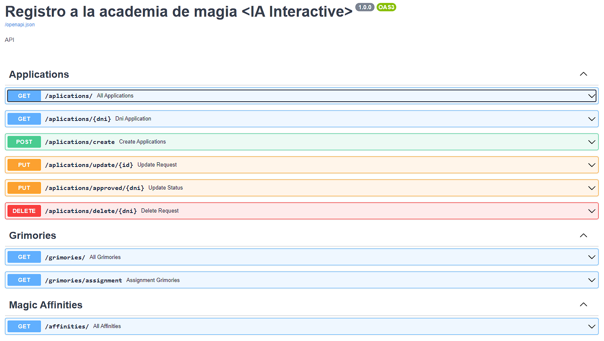
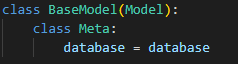

# API Academia de Magia
Aplicacion CRUD creada con FastAPI y PostgreSQL para el registro de solicitudes en una "Academia de magia"
<div style="text-align:center;">
    <a href="https://www.python.org/ftp/python/3.11.2/python-3.11.2-amd64.exe" style="padding:5px">
    
    </a>
    <a href="https://www.enterprisedb.com/downloads/postgres-postgresql-downloads" style="padding:5px">
    
    </a>
    <a href="https://code.visualstudio.com/" style="padding:5px">
    
    </a>
</div>

---

## Instalación (con IDE VSCode)

1. **Crear ambiente virtual** dentro de la carpeta raiz de tu repositorio
```bash
python -m venv env
```
2. **Activar ambiente virtual**
	- Mac OS / Linux
	```bash
	source env/bin/activate
	```
	- Windows
	```bash
	env\Scripts\activate
	```
3. **Asegurate** que activaste el ambiente virtual, deberias de ver en tu terminal algo como esto:
```bash
(env) c:\..\crud-AcademiaMagia>
```
4. **Instala** las dependencias que requiere el proyecto:
```bash
pip install -r requirements.txt
```
5. **Levanta el ambiente** en tu local:
```bash
uvicorn app.main:app --reload
```
6. **Ingresa a** [http://localhost:8000/docs](http://localhost:8000/docs) y deberías de ver algo como lo siguiente:


7. Si lograste ver la pantalla del punto anterior quiere decir que ya levantaste tu aplicacion.
Ahora sigue crear la base de datos y las tablas para poder hacer uso de los endpoints.

---

## Base de Datos
1. Dentro de la ruta **app/assets/BD_Scripts** deje 3 archivos .sql
para que sea mas facil la creación de las tablas y relaciones necesarias.
    
    1.1 **CREATE_DATABASE.sql** sera el primer archivo que abriremos y ejecutaremos en nuestro gestor de base de datos. (Creando la Basa de Datos).

    1.2 **CREATE_TABLES.sql** sera el segundo archivo que abriremos y ejecutaremos en nuestro gestor de base de datos. (Creando las tablas necesarias).

    1.3 **INSERT.sql** tercer y ultimo que abriremos y ejecutaremos en nuestro gestor de base de datos. (Insertando a las tablas la informacion necesaria).

2. Una vez creada nuesta base de datos, podemos volver a IDE para generar los modelos de las tablas a traves del siguiente script:

```bash
(env) c:\..\crud-AcademiaMagia>python -m pwiz -e postgresql -u USER DATABASE_NAME -H HOST -p PORT -s SCHEMA_NAME -v -o -P > models_generated.py
```
3. No te olvides de remplazar los valores de **USER, DATABASE_NAME, HOST, PORT, SCHEME_NAME** por los tuyos.

4. Una vez generados los modelos te crea un archivo llamado **models_generated.py** de ese archivo vas a copiar desde donde dice: 

     
    
    hasta abajo y vas a remplazar el archivo **app/models/db.py** solo ten cuidado de remplazar exactamente desde la misma clase que mencione arriba.

5. Ahora toca crear el archivo **config.json** dentro de la carpeta raiz **(app)** y asignarle el siguiente JSON
```bash
{
    "DEFAULT": {
        "DB_NAME": "Nombre de tu base de datos",
        "DB_USER": "Usuario",
        "DB_PASSWORD": "Contraseña",
        "DB_HOST": "Host",
        "DB_PORT": "Puerto"
    }
 }
```


Si todo se hizo correctamente ya podrias probar los enpoints ya sea utilizando el propio swagger que nos proporciona FastAPI ([http://localhost:8000/docs](http://localhost:8000/docs)) o bien utilizando Postman o alguna otra plataforma para probar APIs.

---

## Desactivar entorno virtual
```bash
(env) c:\..\crud-AcademiaMagia>env\scripts\deactivate
```
